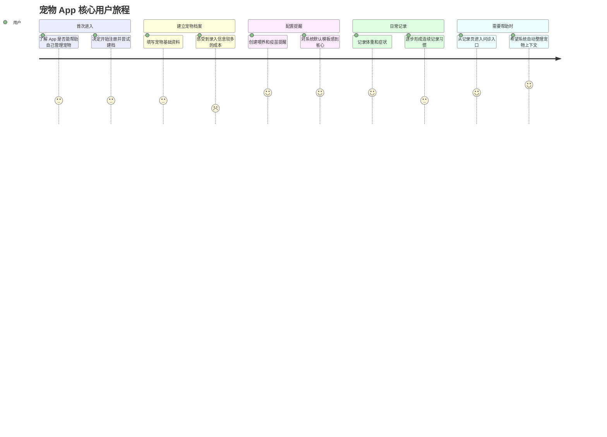
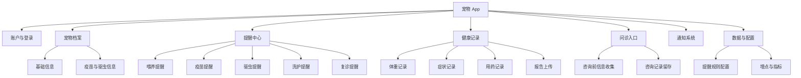
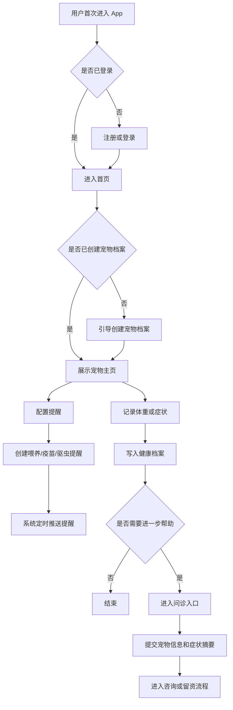
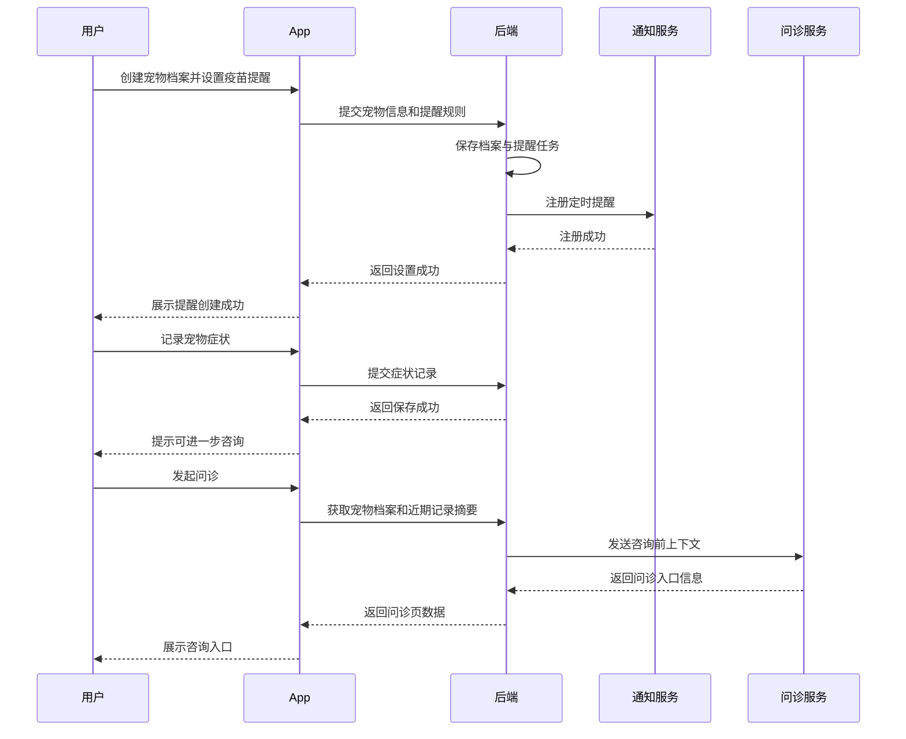

# 宠物 App 产品方案示例

## 1. 需求概述

- 需求名称：宠物健康与日常管理 App
- 需求类型：新产品方案
- 输出版本：完整版示例
- 适用范围：面向北美养宠用户的移动 App 首版规划

## 2. 背景与目标

### 2.1 业务背景

养宠用户在日常管理中常常面临信息分散、提醒缺失、健康记录不连续、问诊服务入口不统一的问题。市场上已有宠物社区、问诊、用品电商等单点产品，但“记录 - 提醒 - 问诊 - 服务转化”的完整闭环仍有优化空间。

### 2.2 当前问题

- 用户难以长期记录宠物体重、疫苗、驱虫、症状等健康信息
- 喂养、洗护、驱虫、复诊等高频事务容易遗忘
- 有问题时无法快速判断是“先查资料”还是“直接问诊”
- 宠物档案、健康记录、服务履约、商品购买之间数据未打通

### 2.3 目标用户

- 养宠新手：缺少系统知识，需要提醒和引导
- 中度养宠家庭：需要高频管理工具和家庭协作能力
- 高关注健康用户：需要完整健康档案、记录和问诊入口

### 2.4 需求目标

- 建立一个从“宠物建档”到“健康管理”和“提醒执行”的核心闭环
- 提高用户对记录、提醒和健康功能的使用频次
- 为后续在线问诊、服务预约、商城转化提供基础数据能力

### 2.5 成功指标

- 新用户建档完成率
- 首周提醒创建率
- 首月健康记录活跃率
- 问诊入口点击率
- 30 日留存率

## 3. 用户洞察与合理假设

### 3.1 已知洞察

- 宠物主人对“忘记重要事项”高度敏感，提醒功能具备高频价值
- 宠物健康问题往往从轻度观察开始，记录和咨询是天然相邻场景
- 用户愿意为“安心感”和“省心效率”买单

### 3.2 合理假设

- 首版如果同时做社区和商城，会分散资源并削弱核心闭环
- 首版核心价值应集中在“建档 + 提醒 + 健康记录 + 轻问诊入口”
- 只要记录和提醒做得足够顺滑，后续问诊与服务转化率会更高

### 3.3 待确认项

- 首版是否必须支持多宠物家庭
- 是否需要家庭成员共享同一宠物档案
- 问诊能力是自建医生网络还是第三方接入
- 北美首发时是否需要和保险、药品、线下诊所联动

## 4. 功能范围

### 4.1 本期纳入

- 账户与登录
- 宠物档案创建与编辑
- 喂养、疫苗、驱虫、洗护、复诊等提醒
- 体重、症状、用药、检查结果等健康记录
- 轻量问诊入口
- 通知触达与提醒中心

### 4.2 本期不纳入

- 宠物社区
- 电商商城
- 线下服务预约完整闭环
- 保险方案比较

### 4.3 依赖条件

- 稳定的推送通知能力
- 统一的宠物档案模型
- 健康记录数据结构
- 问诊或咨询服务接口

## 5. 版本规划

| 版本 | 目标 | 包含内容 | 不包含内容 | 备注 |
|---|---|---|---|---|
| V1 | 建立最小可用闭环 | 登录、单宠建档、基础提醒、体重/症状记录、问诊轻入口、推送通知 | 社区、商城、保险、多成员协作 | 聚焦“记录 + 提醒 + 咨询前置” |
| V1.5 | 补齐关键体验 | 多宠物支持、更多提醒模板、用药记录、咨询摘要优化、提醒完成反馈 | 社区深度互动、交易闭环 | 强化留存和日常使用频次 |
| V2 | 增强增长和效率 | 家庭共享、健康趋势图、线下服务协同、商城导购、会员体系 | 重型内容社区 | 进入转化和商业化阶段 |

## 6. 功能优先级

| 模块 | 功能点 | 优先级 | 原因 |
|---|---|---|---|
| 账户 | 邮箱/手机号登录 | P0 | 没有账户体系无法建立个人和宠物数据闭环 |
| 宠物档案 | 新建宠物档案 | P0 | 是所有提醒、记录、问诊的前置能力 |
| 宠物档案 | 支持宠物基础信息编辑 | P0 | 影响提醒和健康记录准确性 |
| 提醒 | 喂养提醒 | P0 | 高频刚需，直接形成日常使用习惯 |
| 提醒 | 疫苗/驱虫提醒 | P0 | 关键健康场景，用户感知价值高 |
| 健康记录 | 体重记录 | P0 | 最基础健康指标，录入门槛低 |
| 健康记录 | 症状记录 | P0 | 为问诊与后续判断提供上下文 |
| 通知 | App 推送提醒 | P0 | 没有提醒触达就无法形成闭环 |
| 问诊入口 | 发起咨询入口 | P1 | 有价值，但可先做轻入口再逐步扩展 |
| 健康记录 | 用药记录 | P1 | 对重度用户重要，但不是所有用户首需 |
| 健康记录 | 检查报告上传 | P1 | 增强健康档案完整性 |
| 家庭协作 | 多成员共享宠物 | P1 | 对家庭用户重要，但可在首版后补 |
| 数据分析 | 健康趋势图 | P2 | 增强体验，不是首版闭环核心 |
| 社区 | 经验分享社区 | P2 | 非首版必要，容易分散产品重心 |
| 商城 | 宠物用品购买 | P2 | 可作为后续商业化扩展 |

## 7. 用户旅程图

## 8. 功能模块架构图

## 9. 核心流程图

## 10. 时序图

## 11. 风险与待确认项

### 11.1 风险

- 首版能力过多会导致闭环不聚焦
- 问诊服务如果依赖外部平台，交付体验和 SLA 不可完全控
- 健康记录如果录入门槛过高，用户会很快流失

### 11.2 待确认项

- 首发市场是否只做英语
- 首版是否支持猫狗双品类还是先聚焦狗
- 问诊是否接入真人医生、AI 助手，还是仅提供分流入口
- 是否需要首版就接入支付与会员体系

## 12. 详细需求

### 10.1 宠物档案

- 功能目标：建立后续提醒、健康记录、问诊能力的统一基础数据
- 使用对象：所有注册用户
- 触发条件：首次登录后，或用户主动新增宠物
- 核心规则：
  - 至少需要宠物名称、宠物类型、出生日期或年龄区间
  - 疫苗、绝育、过敏信息支持后补
  - 单用户首版默认支持 1 只宠物，后续扩展多宠物
- 异常场景：
  - 用户中途退出建档，需支持草稿保存
  - 出生日期不明确时允许录入年龄区间
- 依赖关系：账户体系、数据模型、首页状态判断

### 10.2 提醒中心

- 功能目标：帮助用户形成可持续的宠物日常管理习惯
- 使用对象：已完成建档用户
- 触发条件：用户在宠物主页或提醒页创建提醒
- 核心规则：
  - 支持喂养、疫苗、驱虫、洗护、复诊等标准模板
  - 支持自定义时间和重复频次
  - 已完成提醒可手动打卡
- 异常场景：
  - 推送失败时，App 内提醒中心仍保留未完成状态
  - 用户修改时区后，需要自动校正提醒时间
- 依赖关系：推送系统、提醒规则引擎、宠物档案

### 10.3 健康记录

- 功能目标：沉淀宠物日常健康变化，为咨询和长期管理提供依据
- 使用对象：所有已建档用户
- 触发条件：用户主动记录体重、症状、用药等信息
- 核心规则：
  - 体重记录需支持日期、数值、备注
  - 症状记录需支持文本描述、时间、严重程度
  - 每条记录默认归属于某一只宠物
- 异常场景：
  - 网络异常时，支持本地暂存后重试
  - 用户重复提交同日同类记录时提示确认
- 依赖关系：宠物档案、数据存储、问诊摘要能力

### 10.4 问诊入口

- 功能目标：当用户出现健康疑问时，提供低门槛咨询入口
- 使用对象：有健康管理需求的用户
- 触发条件：用户在症状记录后点击咨询，或主动进入问诊模块
- 核心规则：
  - 问诊前自动带入宠物基础档案和近期健康记录摘要
  - 首版允许先做“跳转咨询”或“留资预约”模式
  - 咨询记录需要和宠物档案关联
- 异常场景：
  - 第三方问诊服务不可用时，需回退到留言或预约方案
  - 资料不足时，应提示用户补充症状信息
- 依赖关系：宠物档案、健康记录、第三方服务接口

## 13. 非功能要求

- 性能：首页核心数据加载时间控制在可接受范围内，常用操作不应明显卡顿
- 稳定性：提醒任务创建、修改、触发链路需具备监控和告警
- 安全与权限：宠物数据、健康数据属于隐私数据，需要明确权限边界
- 通知与埋点：
  - 建档完成
  - 提醒创建成功
  - 提醒完成打卡
  - 健康记录提交
  - 问诊入口点击
