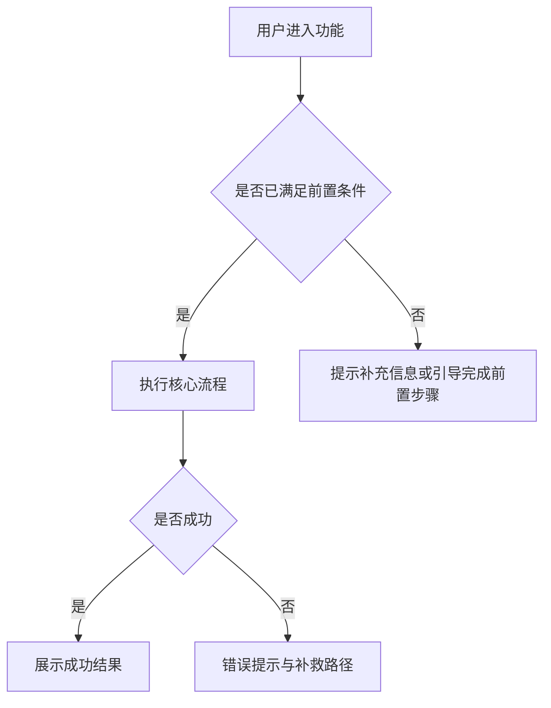

# Mermaid 流程图模板

默认使用 `flowchart`：

```mermaid
flowchart TD
    A[用户进入功能] --> B{是否已满足前置条件}
    B -- 是 --> C[执行核心流程]
    B -- 否 --> D[提示补充信息或引导完成前置步骤]
    C --> E{是否成功}
    E -- 是 --> F[展示成功结果]
    E -- 否 --> G[错误提示与补救路径]
```

使用规则：

- 节点名称中文化
- 明确前置条件、核心分支、异常处理、结果反馈
