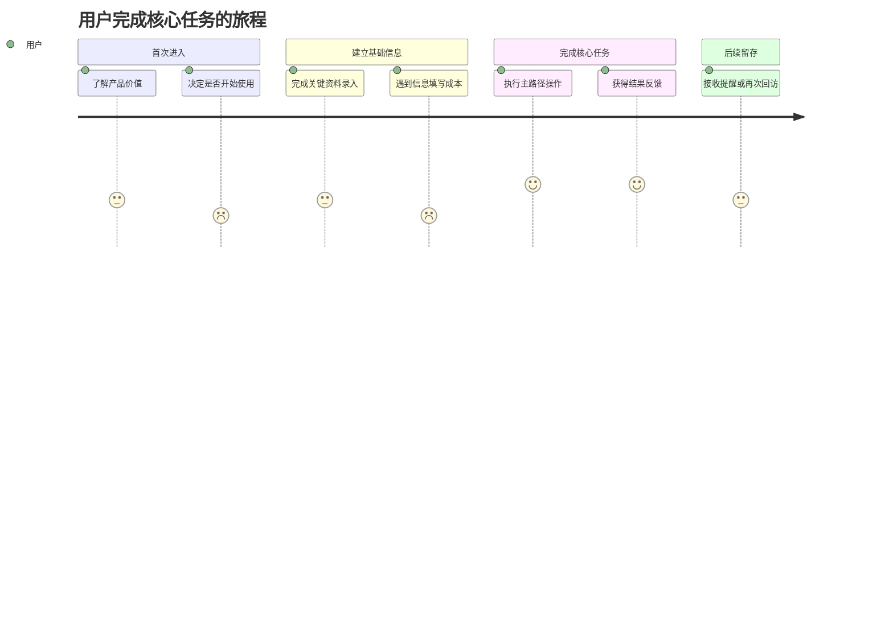

# Mermaid 用户旅程图模板

默认使用 `journey`：

```mermaid
journey
    title 用户完成核心任务的旅程
    section 首次进入
      了解产品价值: 3: 用户
      决定是否开始使用: 2: 用户
    section 建立基础信息
      完成关键资料录入: 3: 用户
      遇到信息填写成本: 2: 用户
    section 完成核心任务
      执行主路径操作: 4: 用户
      获得结果反馈: 4: 用户
    section 后续留存
      接收提醒或再次回访: 3: 用户
```

使用规则：

- 必须按阶段组织
- 阶段名称使用中文
- 节点命名聚焦用户目标和感受
- 如需表达痛点，可在节点文案中直接体现
