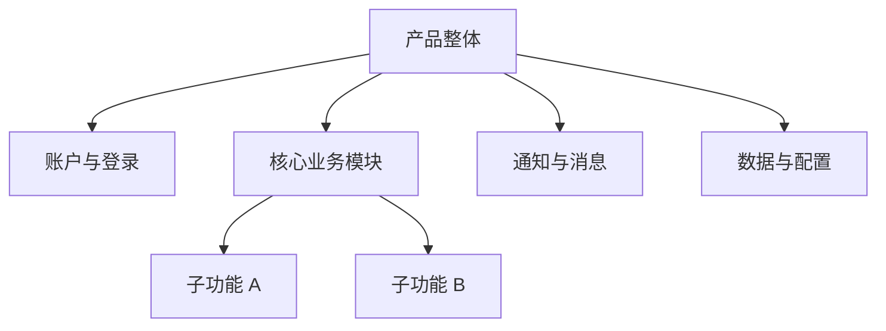

# Mermaid 功能模块架构图模板

默认使用 `graph`：

```mermaid
graph TD
    A[产品整体] --> B[账户与登录]
    A --> C[核心业务模块]
    A --> D[通知与消息]
    A --> E[数据与配置]
    C --> F[子功能 A]
    C --> G[子功能 B]
```

使用规则：

- 从产品总层级到一级模块再到核心子模块
- 不要把页面级节点堆太细
- 优先表达结构关系和依赖归属
