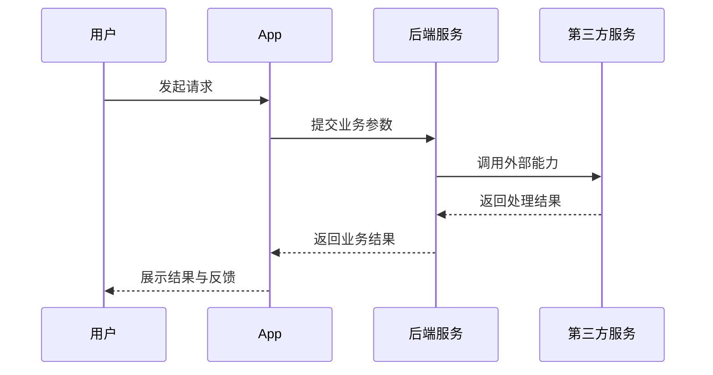

# Mermaid 时序图模板

默认使用 `sequenceDiagram`：

```mermaid
sequenceDiagram
    participant U as 用户
    participant A as App
    participant B as 后端服务
    participant T as 第三方服务

    U->>A: 发起请求
    A->>B: 提交业务参数
    B->>T: 调用外部能力
    T-->>B: 返回处理结果
    B-->>A: 返回业务结果
    A-->>U: 展示结果与反馈
```

使用规则：

- 只保留关键参与方
- 明确请求、处理、回调、异常反馈
